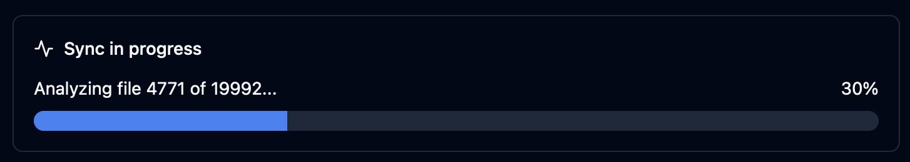
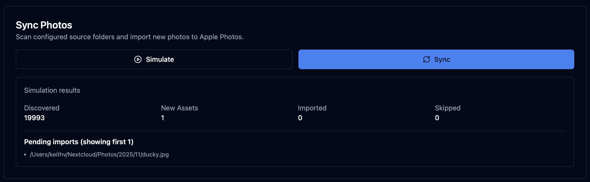
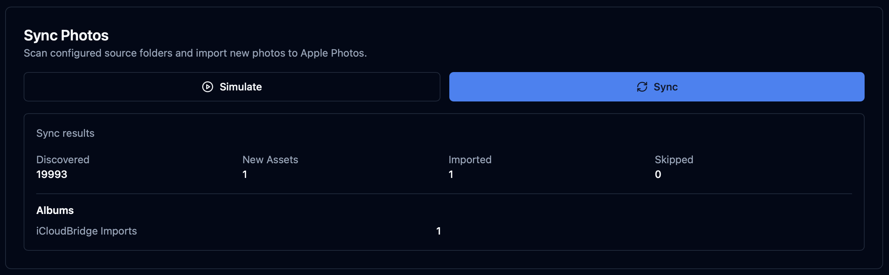
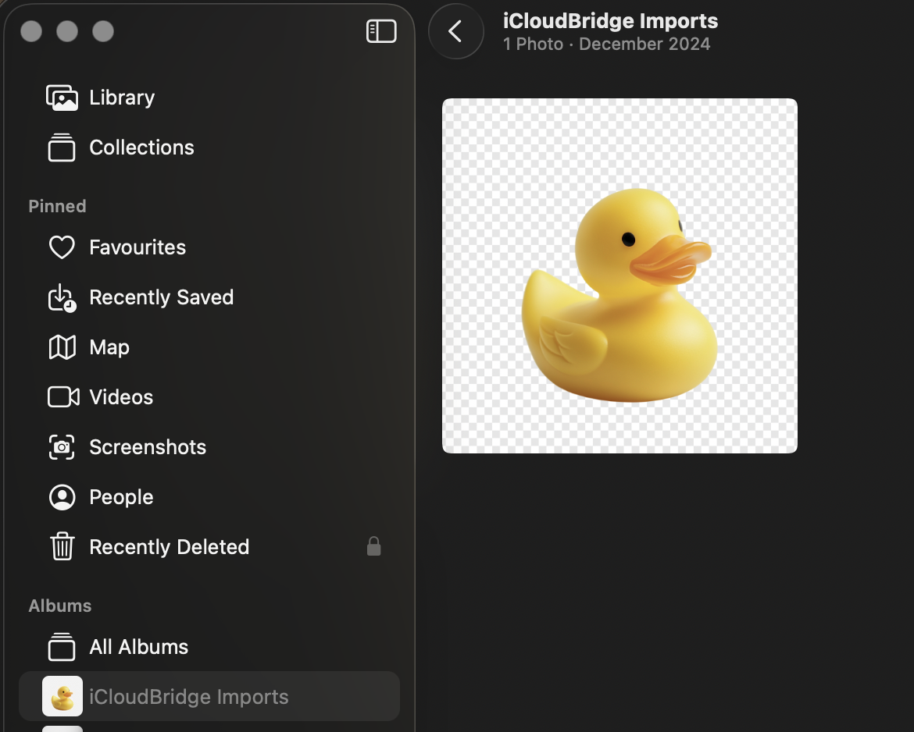

# iCloudBridge User Guide

[< Back to Table of Contents](user.md)

## The Photos Page
The Photos page allows you to synchronise photos between Apple Photos and external services like Nextcloud. By default, iCloudBridge imports photos from external folders into Apple Photos. With bidirectional sync enabled, you can also export photos from Apple Photos to Nextcloud.

### How it Works

> [!TIP]
> Don't skip this part, it's important!

#### One-Way Sync (Default): External → Apple Photos

By default, iCloudBridge photo sync is one-way. It detects new photos in your external photos folder (for example Nextcloud) and imports them into your Apple Photos library. Here's how this works:

1. Bob takes a photo on his iPhone. iCloud syncs this to his photo library, whilst the Nextcloud app on his phone syncs it to Nextcloud (using the Auto Upload feature).
2. When using his Android phone, Bob can see the photos he took on his iPhone using Nextcloud.
3. Bob takes a photo on his Android phone. The Nextcloud app on his phone syncs it to Nextcloud.
4. **This is where iCloudBridge comes in**. iCloudBridge detects a new photo in Bob's Nextcloud library, and syncs it to his Apple Photos library.
5. When using his iPhone, Bob can now see the photos he took on his Android phone using the Apple Photos app.

#### Bidirectional Sync: Apple Photos ↔ Nextcloud

With bidirectional sync enabled, iCloudBridge can also export photos from Apple Photos to Nextcloud. This is useful when:

- You have a shared Apple Photos library with family members
- Your spouse/partner takes photos on their iPhone that you want on Nextcloud
- You want all your Apple Photos backed up to Nextcloud

**Example scenario:**
1. Alice and Bob share an Apple Photos library via iCloud Family Sharing
2. Alice takes a photo on her iPhone - it appears in the shared library
3. iCloudBridge exports Alice's photo to Nextcloud
4. Bob can now access Alice's photo on his Android phone via Nextcloud

> [!NOTE]
> **Import limitation:** Photos imported via iCloudBridge always go to your personal Apple Photos library. There is no way to programmatically import photos directly into a shared library - this is an Apple limitation. If you want imported photos in your shared library, you must manually move them after import.

#### Deduplication

iCloudBridge tracks the origin of every photo to prevent duplicates:
- Photos imported from Nextcloud won't be re-exported back to Nextcloud
- Photos exported from Apple Photos won't be re-imported when they appear in Nextcloud

As you can see, the photo sync functionality is designed to complement an existing one-way sync feature, such as that offered by Nextcloud. Whilst the focus is Nextcloud, nothing really stops you from using any other sync service, as long as your photos are stored in a folder on your Mac.

### Syncing
From the Photos page, click Simulate. 

How long this takes depends on your Mac's speed and the size of your photo library. On my M1 Max with 15,000 photos, the scan takes roughly 90 seconds - so it's not too bad!

> [!TIP]
> You may notice that the number of files scanned does not match the number of photos in your library. This is mostly due to live photos consisting of both a photo and a video.

After the simulation runs, you will be shown what would happen had you to sync:

Here, I'm shown that one new photo would be imported into Apple Photos. 

If this makes sense, go ahead and click "Sync" to carry out the actual sync.

A new photo was imported into Apple Photos. You can verify this by checking your import album:

### Exporting (Bidirectional Sync)

To enable photo export (Apple Photos → Nextcloud), you first need to configure it in the Settings page:

1. Go to **Settings** → **Photos**
2. Change **Sync Mode** from "One-way" to "Bidirectional"
3. Choose your **Export Mode**:
   - **Going Forward** (recommended): Only export photos added after enabling export
   - **Full Library**: Export your entire Apple Photos library (use with caution for large libraries)
4. Choose **Folder Organization**:
   - **Date subfolders** (recommended): Organizes exported photos by year/month (e.g., `2026/02/photo.jpg`)
   - **Flat**: All photos exported to the folder root
5. Click **Save**

> [!IMPORTANT]
> **Disable NextCloud Mobile Auto-Upload**
>
> When using bidirectional sync, you must **disable auto-upload** of media from the NextCloud mobile app. Failing to do so will result in duplicate photos! iCloudBridge will handle exporting your Apple Photos to NextCloud - the mobile app's auto-upload is no longer needed.

The export folder is automatically set to the same folder as your import source. This creates a true bidirectional sync: photos flow in both directions through the same local folder, with NextCloud desktop app handling the cloud synchronization.

#### Using Bidirectional Sync

Once configured, the Photos page automatically adapts to bidirectional mode:

- The section title changes to **"Sync Photos"** (instead of "Import Photos")
- A **"Bidirectional"** badge appears in the status area
- The **Sync** button now performs both import AND export in one operation

**Available actions:**

1. **Simulate**: Preview what would be imported and exported without making any changes
2. **Sync**: Perform the actual sync (imports from Nextcloud, then exports from Apple Photos)
3. **Set Baseline**: Mark the current time as the baseline (only photos after this date will be exported in "Going Forward" mode)
4. **Full Library**: Export your entire Apple Photos library (shows a warning for large libraries)

> [!TIP]
> Always run "Simulate" first to preview the sync. The results show both import and export statistics separately.

#### Status Display

In bidirectional mode, the status section shows both import and export statistics:

**Import stats:**
- **Library Items**: Total photos tracked in source folders
- **Pending**: Photos waiting to be imported
- **Skipped**: Photos already in Apple Photos
- **Last Imported**: Photos imported in the most recent sync

**Export stats:**
- **Total Exported**: Number of photos exported so far
- **Export Mode**: Going Forward or Full Library
- **Export Baseline**: The date after which photos are eligible for export

#### Sync Results

After running a sync (or simulation), the results panel shows statistics for both directions:

- **Import section**: Discovered files, new assets, imported count, skipped count
- **Export section**: Exported count (or "Would Export" for simulations), skipped counts by reason

#### Scheduled Syncs

When you add photos to a schedule, the scheduled sync will also respect the sync mode setting:
- **Import mode**: Schedule only imports from folders
- **Bidirectional mode**: Schedule imports then exports
- **Export mode**: Schedule only exports from Apple Photos

---

[< Previous - Password Synchronisation](passwords.md) | [Next - Schedules >](schedules.md)